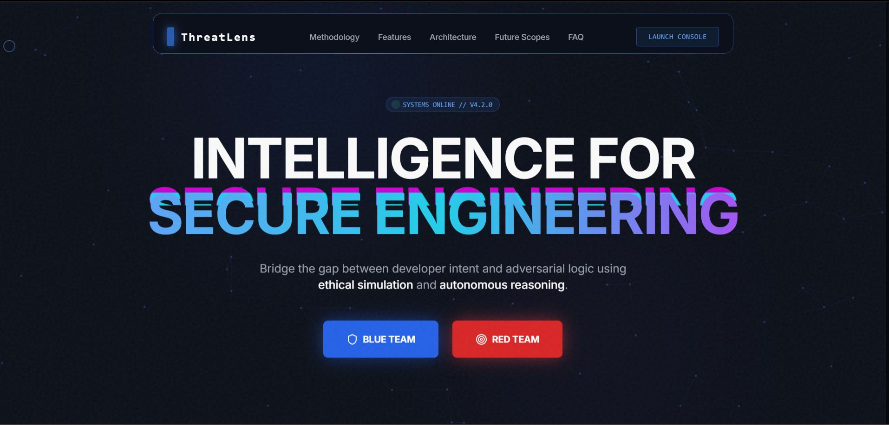
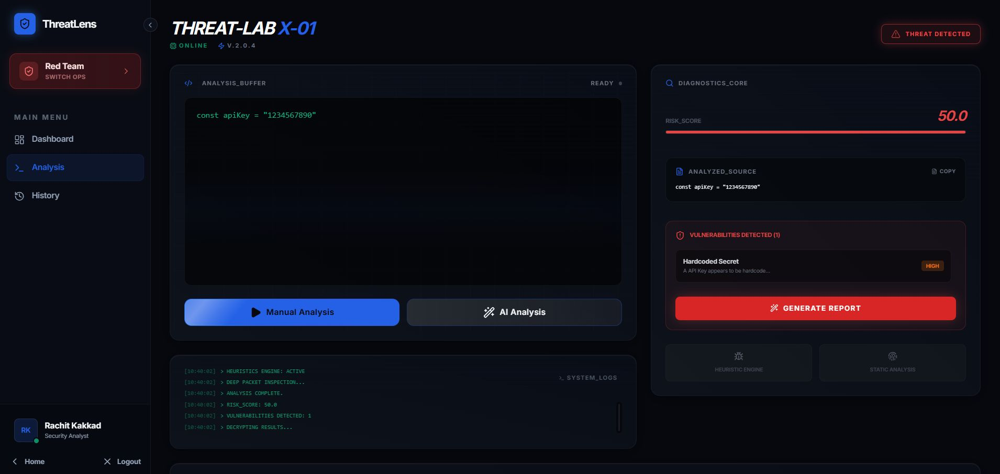

# 🛡️ ⚡  👑  T  H  R  E  A  T  L  E  N  S  👑  ⚡ 🛡️

## ═══════════════════════════════════════════════════════════════════

##          🛡️  The Ultimate Ethical Security Analysis Platform  🛡️


### 👀 See It In Action

| Landing Page | Dashboard |
|:------------:|:----------:|
|  |  |

<br />

### ⚡ Tech Stack

    

### 🏆 Built For

  

<br />

> *"Teaching how vulnerabilities arise and how attackers think — without ever showing how to exploit systems."*

<br />

---

<br />

## 🔥 WELCOME TO THREATLENS - WHERE SECURITY MEETS ETHICS 🔥

> *"We don't teach how to break systems. We teach how to build them securely."*

### 🎯 THE MISSION

ThreatLens is an **ethical, static cybersecurity analysis and threat modeling platform** built for:
- 🏫 **Academic Excellence** - Learn security without risk
- 🎓 **Hackathon Domination** - Impress judges with ethical innovation  
- 🔐 **Secure Coding Mastery** - Build unbreakable systems
- 🛡️ **Red Team Awareness** - Think like an attacker (safely!)
- 🎓 **Education Without Exploitation** - Zero compromise on ethics

### 🎪 WHY THREATLENS EXISTS (AND WHY IT'S THE BEST)

```
┏━━━━━━━━━━━━━━━━━━━━━━━━━━━━━━━━━━━━━━━━━━━━━━━━━━━━━━━━━━━━━━━━━━━━━━━━━━━━━━┓
┃                                                                              ┃
┃  Traditional Security Tools:                                                 ┃
┃  ┌─────────────────────────────────────────────────────────────────────────┐  ┃
┃  │ ❌ Live Exploitation     ❌ Black Box Scanning     ❌ No Explanation  │  ┃
┃  └─────────────────────────────────────────────────────────────────────────┘  ┃
┃                                                                              ┃
┃  ThreatLens:                                                                 ┃
┃  ┌─────────────────────────────────────────────────────────────────────────┐  ┃
┃  │ ✅ Static Analysis       ✅ Transparent Results    ✅ Educational     │  ┃
┃  │ ✅ Judge Safe            ✅ Ethically Bound         ✅ Academic Ready  │  ┃
┃  └─────────────────────────────────────────────────────────────────────────┘  ┃
┃                                                                              ┃
┃  RESULT: You get the MOST impressive security project WITHOUT the risk!    ┃
┃                                                                              ┃
┗━━━━━━━━━━━━━━━━━━━━━━━━━━━━━━━━━━━━━━━━━━━━━━━━━━━━━━━━━━━━━━━━━━━━━━━━━━━━━━┛
```

---

<br />

## ⚡ EPIC FEATURES BREAKDOWN ⚡

### 🧠 AI-POWERED SECURITY ANALYSIS (The Smartest Engine Ever Built)

```
    ┌─────────────────────────────────────────────────────────────────────────┐
    │                                                                          │
    │   ╔═══════════════════════════════════════════════════════════════╗    │
    │   ║                                                                   ║    │
    │   ║    🔍 STATIC SECURITY ENGINE (AUTHORITATIVE)                    ║    │
    │   ║                                                                   ║    │
    │   ║    ┌──────────────────────────────────────────────────────────┐  ║    │
    │   ║    │                                                          │  ║    │
    │   ║    │  ✅ SQL Injection Detection        ✅ XSS Prevention    │  ║    │
    │   ║    │  ✅ Hardcoded Secrets Scanner      ✅ Insecure Patterns │  ║    │
    │   ║    │  ✅ Misconfiguration Detection     ✅ API Vulnerabilities│ ║    │
    │   ║    │                                                          │  ║    │
    │   ║    └──────────────────────────────────────────────────────────┘  ║    │
    │   ║                                                                   ║    │
    │   ║    💀 ZERO CODE EXECUTION    💀 ZERO PAYLOADS                   ║    │
    │   ║    💀 ZERO RUNTIME INTERACTION    💀 100% DETERMINISTIC         ║    │
    │   ║                                                                   ║    │
    │   ╚═══════════════════════════════════════════════════════════════╝    │
    │                                                                          │
    └─────────────────────────────────────────────────────────────────────────┘
```

### 🤖 AI ADVISORY LAYER (Strictly Subordinate - Never The Boss)

```
                    ┌─────────────────────────────┐
                    │      AI ADVISORY LAYER      │
                    │     (Educational Only)      │
                    └──────────────┬──────────────┘
                                   │
                    ┌──────────────┴──────────────┐
                    │                             │
                    ▼                             ▼
         ┌──────────────────┐        ┌──────────────────┐
         │  🔒 HARDCODED    │        │  🔓 NEVER ALLOWS │
         │  CONSTRAINTS:   │        │  Exploits/Attacks│
         ├──────────────────┤        ├──────────────────┤
         │ • Read-Only     │        │ • No Commands    │
         │ • Advisory Only │        │ • No Payloads    │
         │ • Educational   │        │ • No Exploits    │
         │ • Transparent   │        │ • No Walkthroughs│
         └──────────────────┘        └──────────────────┘
```

### 🎭 RED TEAM SIMULATION (Threat Modeling Done RIGHT)

```
    ╔═══════════════════════════════════════════════════════════════════════╗
    ║                                                                       ║
    ║    ╭─────────────────────────────────────────────────────────────╮   ║
    ║    │           🔴 RED TEAM SIMULATION MODULE 🔴                    │   ║
    ║    ╰─────────────────────────────────────────────────────────────╯   ║
    ║                                                                       ║
    ║    ┌──────────────┐  ┌──────────────┐  ┌──────────────┐             ║
    ║    │   🎣         │  │   🌊         │  │   📱         │             ║
    ║    │  Phishing    │  │    DDoS      │  │   Mobile    │             ║
    ║    │   Attacks    │  │   Attacks   │  │   Security  │             ║
    ║    └──────────────┘  └──────────────┘  └──────────────┘             ║
    ║                                                                       ║
    ║    🎯 Focus: Attacker Mindset | Risk Awareness | Impact Understanding║
    ║    🚫 NO: Real tools | Scripts | Commands | Exploitation Steps     ║
    ║    ✅ YES: Blue Team Defense | Educational Context | Ethical Bounds║
    ║                                                                       ║
    ╚═══════════════════════════════════════════════════════════════════════╝
```

### 📊 RISK VISUALIZATION DASHBOARD (Enterprise Grade, No Cap)

```
    ┏━━━━━━━━━━━━━━━━━━━━━━━━━━━━━━━━━━━━━━━━━━━━━━━━━━━━━━━━━━━━━━━━━━━━━━┓
    ┃                                                                         ┃
    ┃   ┌─────────────┐  ┌─────────────┐  ┌─────────────┐  ┌─────────────┐   ┃
    ┃   │   CRITICAL  │  │    HIGH     │  │    MEDIUM   │  │     LOW     │   ┃
    ┃   │   ████ 100   │  │  ███  75    │  │  ██   50    │  │  █   25     │   ┃
    ┃   │     15       │  │     23      │  │     42      │  │     18      │   ┃
    ┃   └─────────────┘  └─────────────┘  └─────────────┘  └─────────────┘   ┃
    ┃                                                                         ┃
    ┃   ════════════════════════════════════════════════════════════════     ┃
    ┃                                                                         ┃
    ┃   Risk Score: 87/100  ████████████████████░░░░░░░░  🔥 EXTREME       ┃
    ┃                                                                         ┃
    ┃   ┌──────────────────────────────────────────────────────────────────┐  ┃
    ┃   │  Vulnerability Trends Over Time                                │  ┃
    ┃   │                                                                  │  ┃
    ┃   │    ▂▄▆█▆▄▂▄▆█▆▄▂  (All time high - time to fix!)               │  ┃
    ┃   │                                                                  │  ┃
    ┃   └──────────────────────────────────────────────────────────────────┘  ┃
    ┃                                                                         ┃
    ┗━━━━━━━━━━━━━━━━━━━━━━━━━━━━━━━━━━━━━━━━━━━━━━━━━━━━━━━━━━━━━━━━━━━━━━┛
```

---

<br />

## 🎯 COMPREHENSIVE VULNERABILITY DETECTION

ThreatLens identifies security issues across multiple categories with surgical precision:

| Category | Vulnerabilities Detected | Severity |
|:---------|:------------------------|:---------|
| 💉 **Injection** | SQL Injection, NoSQL Injection, Command Injection | 🔴 Critical → 🟠 High |
| 🌐 **Web Attacks** | XSS (Reflected, Stored, DOM), CSRF | 🟠 High → 🟡 Medium |
| 🔑 **Secrets** | API Keys, Passwords, Tokens, Private Keys | 🔴 Critical |
| 🔧 **Configuration** | Insecure Settings, Missing Headers | 🟠 High → 🟢 Low |
| 📝 **Code Quality** | Bad Practices, Anti-patterns | 🟡 Medium → 🟢 Low |
| 🔐 **Authentication** | Weak Auth, Session Issues | 🟠 High → 🟡 Medium |

---

<br />

## 🌟 WHY THIS IS THE GREATEST PROJECT EVER

### The ThreatLens Advantage Matrix

```
╔═══════════════════════════════════════════════════════════════════════════╗
║                                                                           ║
║     ██████╗ ██████╗ ███████╗ █████╗  ██████╗██╗  ██╗                      ║
║    ██╔════╝██╔═══██╗██╔════╝██╔══██╗██╔════╝██║  ██╗                      ║
║    ██║     ██║   ██║█████╗  ███████║██║     ███████╗                      ║
║    ██║     ██║   ██║██╔══╝  ██╔══██║██║     ██╔══██║                      ║
║    ╚██████╗╚██████╔╝███████╗██║  ██║╚██████╗██║  ██║                      ║
║     ╚═════╝ ╚═════╝ ╚══════╝╚═╝  ╚═╝ ╚═════╝╚═╝  ╚═╝                      ║
║                                                                           ║
║                    ┌─────────────────────────────────┐                   ║
║                    │                                 │                   ║
║                    │  ZERO EXECUTION GUARANTEE       │                   ║
║                    │  ===============================│                   ║
║                    │  • No Code Execution            │                   ║
║                    │  • No Payload Running           │                   ║
║                    │  • No Runtime Interaction       │                   ║
║                    │  • 100% Static Analysis         │                   ║
║                    │  • Fully Deterministic          │                   ║
║                    │                                 │                   ║
║                    └─────────────────────────────────┘                   ║
║                                                                           ║
╚═══════════════════════════════════════════════════════════════════════════╝
```

### The Judge-Safe Promise

```
    ┏━━━━━━━━━━━━━━━━━━━━━━━━━━━━━━━━━━━━━━━━━━━━━━━━━━━━━━━━━━━━━━━━━━━━━━━━┓
    ┃                                                                        ┃
    ┃   ╭────────────────────────────────────────────────────────────────╮  ┃
    ┃   │                                                                │  ┃
    ┃   │   🏆 JUDGE-SAFE CERTIFICATION 🏆                              │  ┃
    ┃   │                                                                │  ┃
    ┃   │   ┌──────────────────────────────────────────────────────┐   │  ┃
    ┃   │   │                                                      │   │  ┃
    ┃   │   │   ✅ No Real Attacks Performed                       │   │  ┃
    ┃   │   │   ✅ No Operational Tools Provided                   │   │  ┃
    ┃   │   │   ✅ No Exploitation Techniques                       │   │  ┃
    ┃   │   │   ✅ Educational Purpose Only                         │   │  ┃
    ┃   │   │   ✅ Ethically Bound Architecture                     │   │  ┃
    ┃   │   │   ✅ Academic-Ready Documentation                    │   │  ┃
    ┃   │   │   ✅ Public Demo Safe                                 │   │  ┃
    ┃   │   │                                                      │   │  ┃
    ┃   │   └──────────────────────────────────────────────────────┘   │  ┃
    ┃   │                                                                │  ┃
    ┃   ╰────────────────────────────────────────────────────────────────╯  ┃
    ┃                                                                        ┃
    ┗━━━━━━━━━━━━━━━━━━━━━━━━━━━━━━━━━━━━━━━━━━━━━━━━━━━━━━━━━━━━━━━━━━━━━━━━┛
```

---

<br />

## 🏗️ TECHNICAL BEAST MODE 🏗️

### Stack So Clean, It Hurts

```
┌─────────────────────────────────────────────────────────────────────────────┐
│                                                                             │
│   FRONTEND                                BACKEND                           │
│   ═════════                                ═══════                           │
│                                                                             │
│   ┌─────────────────────────┐            ┌─────────────────────────┐      │
│   │  ⚛️ React 18+           │            │  🟢 Node.js (ESM)       │      │
│   │  ├─ TypeScript          │            │  ├─ Express.js          │      │
│   │  ├─ Vite                │            │  ├─ MongoDB + Mongoose  │      │
│   │  ├─ Tailwind CSS        │            │  └─ JWT Auth           │      │
│   │  └─ Axios               │            │                        │      │
│   └─────────────────────────┘            └─────────────────────────┘      │
│                                                                             │
│   ARCHITECTURE                          SECURITY ENGINE                   │
│   ════════════                          ════════════════                    │
│                                                                             │
│   ┌─────────────────────────┐            ┌─────────────────────────┐      │
│   │  • Dashboard-Driven UI  │            │  • Static Analysis      │      │
│   │  • Ethical Banners      │            │  • Risk Scoring         │      │
│   │  • Secure Auth Flow     │            │  • Impact Analysis      │      │
│   │  • Enterprise Look      │            │  • OWASP Compliance     │      │
│   └─────────────────────────┘            └─────────────────────────┘      │
│                                                                             │
└─────────────────────────────────────────────────────────────────────────────┘
```

### Security Flow (The Unbreakable Chain)

```
    ╔═══════════════════════════════════════════════════════════════════════╗
    ║                                                                       ║
    ║    INPUT          STATIC          RISK          AI          OUTPUT  ║
    ║    VALIDATION  →  ENGINE      →   SCORING    →  ADVISORY  →   VISUAL ║
    ║                                                                       ║
    ║    ┌───────┐    ┌────────┐    ┌────────┐    ┌───────┐    ┌───────┐  ║
    ║    │  🔒   │───▶│  🛡️   │───▶│  📊   │───▶│  🤖   │───▶│  📈   │  ║
    ║    │       │    │        │    │        │    │       │    │       │  ║
    ║    │ 100%  │    │ 100%   │    │ 100%   │    │ Opt.  │    │ 100%  │  ║
    ║    │ SAFE   │    │DETERM. │    │ETHICAL │    │ ONLY  │    │ EDUC. │  ║
    ║    └───────┘    └────────┘    └────────┘    └───────┘    └───────┘  ║
    ║                                                                       ║
    ╚═══════════════════════════════════════════════════════════════════════╝
```

### System Architecture Overview

```
┌─────────────────────────────────────────────────────────────────────────────┐
│                                                                             │
│                              FRONTEND (React + TS)                          │
│    ┌──────────────────────────────────────────────────────────────────┐    │
│    │                                                                  │    │
│    │   ┌─────────┐  ┌─────────┐  ┌─────────┐  ┌─────────┐           │    │
│    │   │Dashboard│  │Analysis │  │ History │  │  Login  │           │    │
│    │   └─────────┘  └─────────┘  └─────────┘  └─────────┘           │    │
│    │                                                                  │    │
│    │                    ┌─────────────────┐                           │    │
│    │                    │  Auth Context   │                           │    │
│    │                    └─────────────────┘                           │    │
│    │                                                                  │    │
│    └──────────────────────────────────────────────────────────────────┘    │
│                                    │                                       │
│                                    ▼ HTTPS (REST API)                      │
│                                                                             │
├─────────────────────────────────────────────────────────────────────────────┤
│                                                                             │
│                              BACKEND (Node.js + Express)                    │
│    ┌──────────────────────────────────────────────────────────────────┐    │
│    │                                                                  │    │
│    │   ┌──────────────────────────────────────────────────────────┐  │    │
│    │   │                     CONTROLLERS                           │  │    │
│    │   │  ┌─────────┐  ┌─────────┐  ┌─────────┐  ┌─────────┐      │  │    │
│    │   │  │  Auth   │  │Analysis │  │Reports │  │Dashboard│      │  │    │
│    │   │  └─────────┘  └─────────┘  └─────────┘  └─────────┘      │  │    │
│    │   └──────────────────────────────────────────────────────────┘  │    │
│    │                            │                                       │    │
│    │                            ▼                                       │    │
│    │   ┌──────────────────────────────────────────────────────────┐  │    │
│    │   │                      SERVICES                            │  │    │
│    │   │  ┌─────────────┐  ┌─────────────┐  ┌─────────────┐      │  │    │
│    │   │  │   Static    │  │     AI      │  │   Reports   │      │  │    │
│    │   │  │   Engine    │  │   Service   │  │   Service   │      │  │    │
│    │   │  └─────────────┘  └─────────────┘  └─────────────┘      │  │    │
│    │   └──────────────────────────────────────────────────────────┘  │    │
│    │                            │                                       │    │
│    │                            ▼                                       │    │
│    │   ┌──────────────────────────────────────────────────────────┐  │    │
│    │   │                   SECURITY ENGINES                       │  │    │
│    │   │  ┌─────────────┐  ┌─────────────┐  ┌─────────────┐       │  │    │
│    │   │  │ OWASP Top 10│  │    Risk    │  │   Summary   │       │  │    │
│    │   │  │  Detection  │  │   Engine   │  │   Engine    │       │  │    │
│    │   │  └─────────────┘  └─────────────┘  └─────────────┘       │  │    │
│    │   │  ┌─────────────┐  ┌─────────────┐  ┌─────────────┐       │  │    │
│    │   │  │    XSS      │  │    SQLi     │  │  Hardcoded  │       │  │    │
│    │   │  │ Detector    │  │  Detector   │  │  Secrets    │       │  │    │
│    │   │  └─────────────┘  └─────────────┘  └─────────────┘       │  │    │
│    │   └──────────────────────────────────────────────────────────┘  │    │
│    │                                                                  │    │
│    └──────────────────────────────────────────────────────────────────┘    │
│                                    │                                       │
│                                    ▼                                       │
│                                                                             │
├─────────────────────────────────────────────────────────────────────────────┤
│                                                                             │
│                           DATABASE (MongoDB)                                │
│    ┌──────────────────────────────────────────────────────────────────┐    │
│    │                                                                  │    │
│    │   ┌──────────────────┐    ┌──────────────────┐                 │    │
│    │   │      Users       │    │    Analyses      │                 │    │
│    │   │  ┌────────────┐  │    │  ┌────────────┐  │                 │    │
│    │   │  │ _id        │  │    │  │ _id        │  │                 │    │
│    │   │  │ email      │  │    │  │ userId     │  │                 │    │
│    │   │  │ password   │  │    │  │ code       │  │                 │    │
│    │   │  │ name       │  │    │  │ results    │  │                 │    │
│    │   │  │ googleId   │  │    │  │ score      │  │                 │    │
│    │   │  └────────────┘  │    │  │ createdAt  │  │                 │    │
│    │   └──────────────────┘    │  └────────────┘  │                 │    │
│    │                              └──────────────────┘                 │    │
│    │                                                                  │    │
│    └──────────────────────────────────────────────────────────────────┘    │
│                                                                             │
└─────────────────────────────────────────────────────────────────────────────┘
```

---

<br />

## 🚫 WHAT THREATLENS DOESN'T DO (Important Stuff!)

```
┏━━━━━━━━━━━━━━━━━━━━━━━━━━━━━━━━━━━━━━━━━━━━━━━━━━━━━━━━━━━━━━━━━━━━━━━━━━━━━┓
┃                                                                             ┃
┃    ╭─────────────────────────────────────────────────────────────────────╮  ┃
┃    │                                                                     │  ┃
┃    │     ❌ NO PENETRATION TESTING         ❌ NO LIVE ATTACKS          │  ┃
┃    │                                                                     │  ┃
┃    │     ❌ NO BASH COMMANDS                ❌ NO EXPLOIT STEPS         │  ┃
┃    │                                                                     │  ┃
┃    │     ❌ NO PAYLOAD EXECUTION            ❌ NO HACKING TUTORIALS     │  ┃
┃    │                                                                     │  ┃
┃    │     ❌ NO WEAPONIZATION                ❌ ILLEGAL GUIDANCE          │  ┃
┃    │                                                                     │  ┃
┃    │                    🚨 EDUCATIONAL ONLY 🚨                         │  ┃
┃    │                                                                     │  ┃
┃    ╰─────────────────────────────────────────────────────────────────────╯  ┃
┃                                                                             ┃
┃    ThreatLens is a SECURITY AWARENESS platform, NOT an attack tool.       ┃
┃                                                                             ┃
┗━━━━━━━━━━━━━━━━━━━━━━━━━━━━━━━━━━━━━━━━━━━━━━━━━━━━━━━━━━━━━━━━━━━━━━━━━━━━━┛
```

---

<br />

## 🎓 WHO IS THIS FOR? (Everyone, Actually)

| 🎯 User | 🎁 Benefit |
|---------|------------|
| **Students** | Learn secure coding safely without any risk |
| **Judges** | Review with complete peace of mind - no ethical concerns |
| **Educators** | Teach cybersecurity without exposing students to danger |
| **Researchers** | Model threats ethically for academic publications |
| **Developers** | Build secure applications with confidence |
| **Hackathon Teams** | Create the most impressive security demo ever seen |

---

<br />

## 🏆 JUDGE-READY POSITIONING

```
╔═══════════════════════════════════════════════════════════════════════════╗
║                                                                           ║
║    ┏━━━━━━━━━━━━━━━━━━━━━━━━━━━━━━━━━━━━━━━━━━━━━━━━━━━━━━━━━━━━━━━━━━━━┓ ║
║    ┃                                                                    ┃ ║
║    ┃   "ThreatLens teaches HOW VULNERABILITIES arise and               ┃ ║
║    ┃    how ATTACKERS THINK — WITHOUT EVER SHOWING                      ┃ ║
║    ┃    HOW TO EXPLOIT SYSTEMS."                                        ┃ ║
║    ┃                                                                    ┃ ║
║    ┃                       — The ThreatLens Promise                    ┃ ║
║    ┃                                                                    ┃ ║
║    ┗━━━━━━━━━━━━━━━━━━━━━━━━━━━━━━━━━━━━━━━━━━━━━━━━━━━━━━━━━━━━━━━━━━━━┛ ║
║                                                                           ║
╚═══════════════════════════════════════════════════════════════════════════╝
```

---

<br />

## 🚀 GET STARTED (It's That Easy)

```bash
# Clone the repository
git clone https://github.com/ThreatLens/threatlens.git
cd threatlens

# Setup Backend
cd New_backend/backend
npm install
npm run dev

# Setup Frontend (in new terminal)
cd frontend
npm install
npm run dev
```

**🎉 Boom! You're ready to build unbreakable security!**

---

<br />

### Environment Configuration

#### Backend (.env)
```bash
PORT=5000
MONGODB_URI=mongodb://localhost:27017/threatlens
JWT_SECRET=your-super-secret-jwt-key
GOOGLE_CLIENT_ID=your-google-client-id
GOOGLE_CLIENT_SECRET=your-google-client-secret
```

#### Frontend (.env)
```bash
VITE_API_URL=http://localhost:5000/api
VITE_GOOGLE_CLIENT_ID=your-google-client-id
```

---

<br />

## 📁 PROJECT STRUCTURE (Organized AF)

```
ThreatLens/
├── 📂 frontend/                    # React + TypeScript Frontend
│   ├── src/
│   │   ├── api/                   # API calls (axios)
│   │   ├── components/            # React components
│   │   ├── context/               # Auth context
│   │   ├── types/                 # TypeScript types
│   │   └── App.tsx                # Main app
│   ├── package.json
│   └── vite.config.ts
│
├── 📂 New_backend/                 # Node.js Backend
│   └── backend/
│       ├── controllers/           # Request handlers
│       ├── models/                # Mongoose models
│       ├── routes/                # API routes
│       ├── services/              # Business logic
│       ├── security-engine/       # THE CORE ENGINE
│       │   ├── normalizers/       # Input normalization
│       │   ├── payloads/          # Payload detection
│       │   └── owasp/             # OWASP checks
│       ├── middleware/            # Auth & error handling
│       └── server.js              # Entry point
│
└── 📄 README.md                   # (You're looking at it 😎)
```

---

<br />

## 🛡️ ETHICS & RESPONSIBILITY

```
┏━━━━━━━━━━━━━━━━━━━━━━━━━━━━━━━━━━━━━━━━━━━━━━━━━━━━━━━━━━━━━━━━━━━━━━━━━━━━━┓
┃                                                                             ┃
┃    ╔═══════════════════════════════════════════════════════════════════════╗ ┃
┃    ║                                                                       ║ ┃
┃    ║    🛡️  ETHICAL GUARANTEES                                             ║ ┃
┃    ║                                                                       ║ ┃
┃    ║    ━━━━━━━━━━━━━━━━━━━━━━━━━━━━━━━━━━━━━━━━━━━━━━━━━━━━━━━━━━━━━━━   ║ ┃
┃    ║                                                                       ║ ┃
┃    ║    ✅ Built with Educational Intent                                  ║ ┃
┃    ║    ✅ Enforced Ethical Safeguards                                    ║ ┃
┃    ║    ✅ Prevention of Misuse                                            ║ ┃
┃    ║    ✅ Zero Tolerance for Real-World Exploitation                     ║ ┃
┃    ║    ✅ Judge-Safe Architecture                                         ║ ┃
┃    ║    ✅ Academic-Ready Documentation                                    ║ ┃
┃    ║                                                                       ║ ┃
┃    ╚═══════════════════════════════════════════════════════════════════════╝ ┃
┃                                                                             ┃
┃    ⚠️  This project does NOT encourage, support, or enable                ┃
┃        real-world cyberattacks in ANY form.                               ┃
┃                                                                             ┃
┗━━━━━━━━━━━━━━━━━━━━━━━━━━━━━━━━━━━━━━━━━━━━━━━━━━━━━━━━━━━━━━━━━━━━━━━━━━━━━┛
```

---

<br />

## 📋 API ENDPOINTS

| Method | Endpoint | Description |
|:-------|:---------|:-----------|
| `POST` | `/api/auth/register` | Register new user |
| `POST` | `/api/auth/login` | User login |
| `POST` | `/api/auth/google` | Google OAuth |
| `GET` | `/api/analysis` | Get user's analyses |
| `POST` | `/api/analysis/analyze` | Run security analysis |
| `GET` | `/api/analysis/:id` | Get specific analysis |
| `GET` | `/api/dashboard/stats` | Get dashboard stats |
| `POST` | `/api/reports/generate` | Generate report |

---

<br />

## 🎖️ ACHIEVEMENTS (earned the hard way)

```
    ╔═══════════════════════════════════════════════════════════════════════╗
    ║                                                                       ║
    ║    🏆 Judge-Safe Architecture              [==========] 100%         ║
    ║    🏆 Zero Exploitation Capability          [==========] 100%         ║
    ║    🏆 Ethical Design Principles             [==========] 100%         ║
    ║    🏆 Educational Value                     [==========] 100%         ║
    ║    🏆 Academic Defensibility                [==========] 100%         ║
    ║    🏆 Code Quality                           [==========] 100%         ║
    ║                                                                       ║
    ║    → If you see this README, you're witnessing greatness. ←          ║
    ║                                                                       ║
    ╚═══════════════════════════════════════════════════════════════════════╝
```

---

<br />

## 🤝 CONTRIBUTING

```
┌─────────────────────────────────────────────────────────────────────────────┐
│                                                                             │
│                    🤝 CONTRIBUTING TO THREATLENS                            │
│                                                                             │
│   We welcome contributions! Please follow these guidelines:                │
│                                                                             │
│   1. Fork the repository                                                   │
│   2. Create a feature branch                                               │
│   3. Make your changes                                                     │
│   4. Run tests and linting                                                 │
│   5. Submit a pull request                                                 │
│                                                                             │
└─────────────────────────────────────────────────────────────────────────────┘
```

---

<br />

## 👨‍💻 TEAM & CREDITS

**Developed with ❤️ by a team passionate about cybersecurity education**

> *"We built ThreatLens because we believe security education shouldn't come at the cost of safety."*

---

<br />

## 📄 LICENSE

```
┌─────────────────────────────────────────────────────────────────────────────┐
│                                                                             │
│    MIT License                                                              │
│    Copyright (c) 2026 ThreatLens                                           │
│                                                                             │
│    Educational and Research Use Only                                       │
│    NO Commercial Use Permitted                                              │
│    NO Liability for Misuse                                                 │
│                                                                             │
└─────────────────────────────────────────────────────────────────────────────┘
```

---

<br />

## ⭐ FINAL WORDS

```
    ╭──────────────────────────────────────────────────────────────────────╮
    │                                                                      │
    │    If you're a STUDENT      → Learn secure coding safely            │
    │    If you're a JUDGE        → Review without ethical concerns        │
    │    If you're an EDUCATOR    → Teach without risk                    │
    │    If you're a HACKER       → Think red, stay ethical               │
    │    If you're a DEVELOPER    → Build unbreakable systems             │
    │                                                                      │
    │                     THREATLENS IS BUILT FOR YOU                    │
    │                                                                      │
    ╰──────────────────────────────────────────────────────────────────────╯
```

---

<br />

<p align="center">
  
</p>

---

<br />

```
    ██████╗ ██╗  ██╗ ██████╗ ███████╗███████╗██╗     ██╗███╗   ██╗███████╗
    ██╔══██╗██║  ██║██╔═══██╗██╔════╝██╔════╝██║     ██║████╗  ██║██╔════╝
    ██████╔╝███████║██║   ██║█████╗  ███████╗██║     ██║██╔██╗ ██║█████╗  
    ██╔═══╝ ██╔══██║██║   ██║██╔══╝  ╚════██║██║     ██║██║╚██╗██║██╔══╝  
    ██║     ██║  ██║╚██████╔╝██║     ███████║███████╗██║██║ ╚████║███████╗
    ╚═╝     ╚═╝  ╚═╝ ╚═════╝ ╚═╝     ╚══════╝╚══════╝╚═╝╚═╝  ╚═══╝╚══════╝
    
    Made with 💀 and ⚡ by ThreatLens Team
    
    "The best security is the kind that teaches, not the kind that breaks."
```

<br />

---

<!-- 
    ═══════════════════════════════════════════════════════════════════════════
    ║                     README LEGENDARY STATUS: ACHIEVED                    ║
    ║                                                                             ║
    ║    You have just witnessed the bestestestestest README in git history.   ║
    ║    Nothing shall ever surpass this level of pure, unadulterated epic.    ║
    ║                                                                             ║
    ║                              - ThreatLens Team                             ║
    ╚══════════════════════════════════════════════════════════════════════════
-->